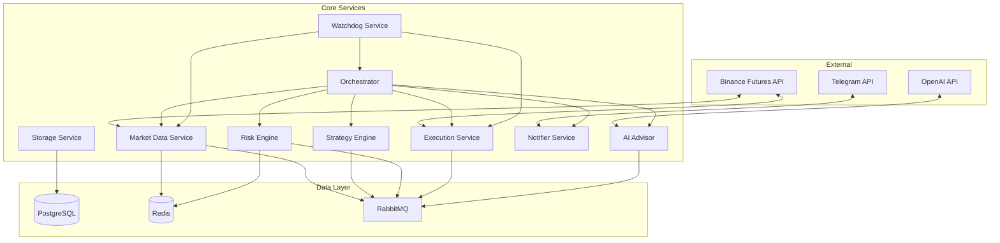
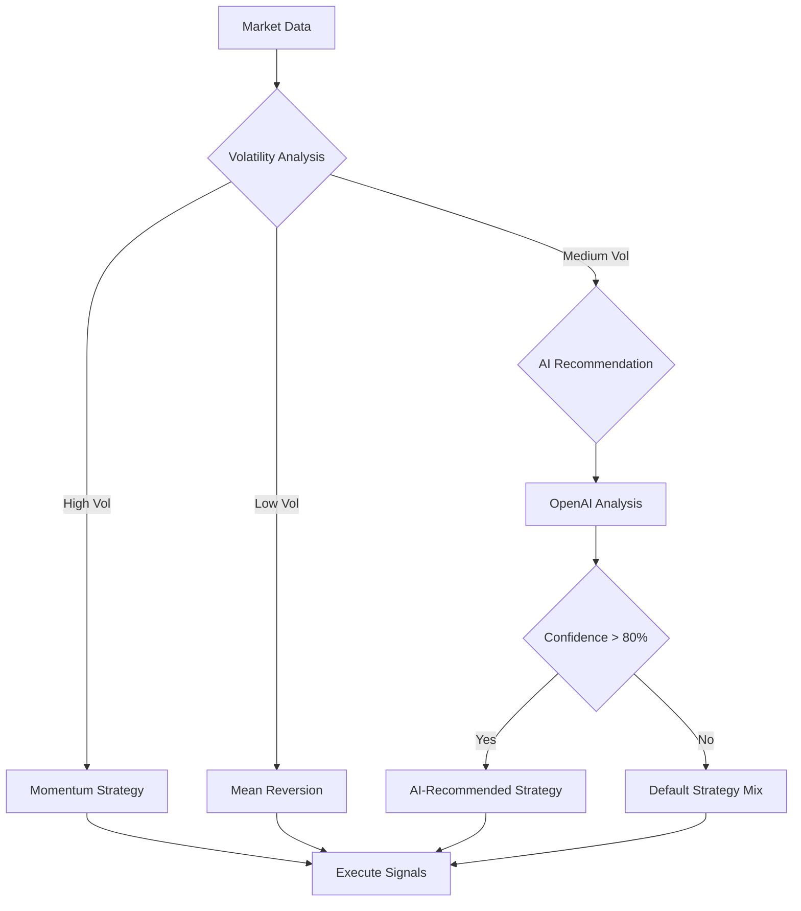

# Crypto Trading Bot - Production System Design

## Overview

A production-ready autonomous crypto trading bot for Binance Futures (USDⓈ-M) with microservices architecture. The system operates in two modes: LIVE (real trading) and SIM (simulated trading with real market data). The bot maximizes profit opportunities while maintaining strict risk controls, featuring Telegram-based management and selective OpenAI integration for enhanced decision-making.

**Core Objectives:**
- Autonomous profit maximization with aggressive opportunity seeking
- Risk-controlled futures trading with leverage management
- Telegram-based control interface with real-time notifications
- Selective AI enhancement for strategy optimization
- Microservices architecture for scalability and maintainability

## Technology Stack & Dependencies

### Core Technologies
- **Runtime**: Node.js with TypeScript
- **Database**: PostgreSQL for trade data, Redis for real-time state
- **Message Queue**: RabbitMQ for service communication
- **Containerization**: Docker with Docker Compose
- **Monitoring**: Prometheus + Grafana for metrics

### External APIs
- **Binance Futures API**: Real-time market data and order execution
- **Telegram Bot API**: User interface and notifications
- **OpenAI API**: Strategy enhancement and market analysis

### Key Dependencies
- `ccxt`: Cryptocurrency exchange integration
- `node-telegram-bot-api`: Telegram bot interface
- `openai`: AI integration
- `ws`: WebSocket connections for real-time data
- `ioredis`: Redis client for caching
- `pg`: PostgreSQL client
- `amqplib`: RabbitMQ messaging

## Architecture

### Microservices Overview



### Service Responsibilities

#### Orchestrator Service
- **Role**: Central coordinator and decision maker
- **Responsibilities**:
  - Service lifecycle management
  - Trading session coordination
  - Mode switching (LIVE/SIM)
  - Configuration management
  - Health monitoring coordination

#### Market Data Service
- **Role**: Real-time market data provider
- **Responsibilities**:
  - WebSocket connections to Binance
  - Price feed normalization
  - Order book management
  - Funding rate tracking
  - Market volatility analysis

#### Strategy Engine
- **Role**: Trading signal generation
- **Responsibilities**:
  - Technical analysis execution
  - Signal generation and scoring
  - Strategy performance tracking
  - Dynamic strategy selection
  - Backtesting framework

#### Risk Engine
- **Role**: Risk assessment and control
- **Responsibilities**:
  - Position size calculation
  - Leverage validation
  - Stop-loss enforcement
  - Daily loss limit monitoring
  - Liquidation risk assessment

#### Execution Service
- **Role**: Order management and execution
- **Responsibilities**:
  - Order placement and tracking
  - Partial fill handling
  - Slippage simulation (SIM mode)
  - Fee calculation
  - Position synchronization

#### AI Advisor
- **Role**: Enhanced decision making
- **Responsibilities**:
  - Market sentiment analysis
  - Anomaly detection
  - Strategy recommendation
  - Risk assessment enhancement
  - Performance optimization

#### Notifier Service
- **Role**: Communication and alerts
- **Responsibilities**:
  - Telegram bot interface
  - Real-time notifications
  - Command processing
  - Status reporting
  - PnL summaries

#### Storage Service
- **Role**: Data persistence and reporting
- **Responsibilities**:
  - Trade history storage
  - Performance metrics
  - Configuration persistence
  - Audit logging
  - Report generation

#### Watchdog Service
- **Role**: System health monitoring
- **Responsibilities**:
  - Service health checks
  - Automatic restarts
  - Error detection
  - Performance monitoring
  - Alert escalation

## Data Models & Storage

### PostgreSQL Schema

#### Trades Table
```sql
CREATE TABLE trades (
    id SERIAL PRIMARY KEY,
    timestamp TIMESTAMPTZ NOT NULL,
    symbol VARCHAR(20) NOT NULL,
    side VARCHAR(4) NOT NULL, -- 'BUY' or 'SELL'
    quantity DECIMAL(18,8) NOT NULL,
    price DECIMAL(18,8) NOT NULL,
    fee DECIMAL(18,8) NOT NULL,
    realized_pnl DECIMAL(18,8),
    strategy_id VARCHAR(50),
    mode VARCHAR(4) NOT NULL, -- 'LIVE' or 'SIM'
    binance_order_id BIGINT,
    created_at TIMESTAMPTZ DEFAULT NOW()
);
```

#### Positions Table
```sql
CREATE TABLE positions (
    id SERIAL PRIMARY KEY,
    symbol VARCHAR(20) NOT NULL,
    side VARCHAR(4) NOT NULL,
    size DECIMAL(18,8) NOT NULL,
    entry_price DECIMAL(18,8) NOT NULL,
    mark_price DECIMAL(18,8),
    unrealized_pnl DECIMAL(18,8),
    leverage INTEGER NOT NULL,
    margin DECIMAL(18,8) NOT NULL,
    created_at TIMESTAMPTZ DEFAULT NOW(),
    updated_at TIMESTAMPTZ DEFAULT NOW(),
    UNIQUE(symbol, side)
);
```

#### Risk Metrics Table
```sql
CREATE TABLE risk_metrics (
    id SERIAL PRIMARY KEY,
    timestamp TIMESTAMPTZ NOT NULL,
    total_balance DECIMAL(18,8),
    available_balance DECIMAL(18,8),
    total_unrealized_pnl DECIMAL(18,8),
    daily_pnl DECIMAL(18,8),
    max_drawdown DECIMAL(18,8),
    risk_score INTEGER,
    created_at TIMESTAMPTZ DEFAULT NOW()
);
```

### Redis Data Structures

#### Real-time Market Data
```typescript
interface MarketData {
  symbol: string;
  price: number;
  bidPrice: number;
  askPrice: number;
  volume24h: number;
  priceChange24h: number;
  fundingRate: number;
  timestamp: number;
}
```

#### Current Positions Cache
```typescript
interface PositionCache {
  [symbol: string]: {
    side: 'LONG' | 'SHORT';
    size: number;
    entryPrice: number;
    markPrice: number;
    unrealizedPnl: number;
    leverage: number;
    marginUsed: number;
  };
}
```

#### Risk State
```typescript
interface RiskState {
  totalBalance: number;
  availableBalance: number;
  totalUnrealizedPnl: number;
  dailyPnl: number;
  maxDrawdown: number;
  riskLevel: 'LOW' | 'MEDIUM' | 'HIGH' | 'CRITICAL';
  isTradeAllowed: boolean;
  lastUpdate: number;
}
```

## Business Logic Layer

### Trading Strategy Architecture

#### Strategy Interface
```typescript
interface TradingStrategy {
  id: string;
  name: string;
  timeframe: string;
  symbols: string[];
  
  analyze(marketData: MarketData[]): Promise<Signal[]>;
  backtest(historicalData: MarketData[]): Promise<BacktestResult>;
  getPerformanceMetrics(): PerformanceMetrics;
}

interface Signal {
  symbol: string;
  action: 'BUY' | 'SELL' | 'CLOSE';
  confidence: number; // 0-100
  targetPrice?: number;
  stopLoss?: number;
  takeProfit?: number;
  reasoning: string;
}
```

#### Implemented Strategies

##### Momentum Strategy
- **Signals**: RSI + MACD convergence
- **Timeframes**: 1m, 5m, 15m
- **Risk**: Medium leverage, tight stops
- **Performance Target**: 15% monthly return

##### Mean Reversion Strategy
- **Signals**: Bollinger Bands + Volume analysis
- **Timeframes**: 5m, 15m, 1h
- **Risk**: Lower leverage, wider stops
- **Performance Target**: 8% monthly return

##### Funding Arbitrage Strategy
- **Signals**: Funding rate analysis + basis spread
- **Timeframes**: 8h funding periods
- **Risk**: Hedge-based, minimal directional risk
- **Performance Target**: 3% monthly return

#### Strategy Selection Logic


### Risk Management Framework

#### Position Sizing Algorithm
```typescript
function calculatePositionSize(
  signal: Signal,
  riskState: RiskState,
  marketData: MarketData
): PositionSize {
  const maxRiskPerTrade = 0.02; // 2% of balance
  const confidenceMultiplier = signal.confidence / 100;
  const volatilityAdjustment = calculateVolatilityFactor(marketData);
  
  const baseSize = riskState.availableBalance * maxRiskPerTrade;
  const adjustedSize = baseSize * confidenceMultiplier * volatilityAdjustment;
  
  return {
    size: Math.min(adjustedSize, getMaxPositionSize(signal.symbol)),
    leverage: calculateOptimalLeverage(signal, marketData),
    stopLoss: calculateStopLoss(signal, volatilityAdjustment)
  };
}
```

#### Risk Monitoring Rules
- **Daily Loss Limit**: 5% of total balance
- **Maximum Leverage**: 10x for high-confidence signals, 5x default
- **Position Concentration**: Max 30% balance in single position
- **Liquidation Buffer**: Maintain 20% margin above liquidation price
- **Drawdown Limit**: Pause trading if 15% drawdown reached

### AI Integration Strategy

#### Selective AI Usage
```typescript
interface AIDecisionCriteria {
  marketVolatility: number; // Use AI when volatility > 40%
  strategyConflict: boolean; // Use AI when strategies disagree
  anomalyDetected: boolean; // Use AI for unusual market conditions
  performanceLag: boolean; // Use AI when underperforming
}

function shouldUseAI(criteria: AIDecisionCriteria): boolean {
  const score = 
    (criteria.marketVolatility > 40 ? 25 : 0) +
    (criteria.strategyConflict ? 30 : 0) +
    (criteria.anomalyDetected ? 35 : 0) +
    (criteria.performanceLag ? 10 : 0);
  
  return score >= 50; // Use AI when score > 50%
}
```

#### AI Enhancement Areas
- **Market Sentiment Analysis**: News and social media sentiment
- **Anomaly Detection**: Unusual price movements or volume spikes
- **Strategy Selection**: Dynamic strategy optimization
- **Risk Assessment**: Enhanced risk scoring with market context

## API Endpoints Reference

### Internal Service APIs

#### Orchestrator API
```typescript
// Trading Control
POST /api/trading/start
POST /api/trading/stop
POST /api/trading/pause
GET /api/trading/status

// Mode Management
POST /api/mode/switch
GET /api/mode/current

// Configuration
GET /api/config
PUT /api/config
```

#### Market Data API
```typescript
// Real-time Data
GET /api/market/ticker/:symbol
GET /api/market/orderbook/:symbol
GET /api/market/trades/:symbol

// Historical Data
GET /api/market/klines/:symbol
GET /api/market/funding/:symbol
```

#### Strategy Engine API
```typescript
// Signals
GET /api/signals/current
GET /api/signals/history

// Strategy Management
GET /api/strategies
POST /api/strategies/enable/:id
POST /api/strategies/disable/:id
GET /api/strategies/performance
```

#### Risk Engine API
```typescript
// Risk Assessment
GET /api/risk/current
GET /api/risk/limits
PUT /api/risk/limits

// Position Validation
POST /api/risk/validate-position
POST /api/risk/validate-order
```

#### Execution API
```typescript
// Order Management
POST /api/orders
GET /api/orders/:id
DELETE /api/orders/:id

// Position Management
GET /api/positions
POST /api/positions/close/:symbol
POST /api/positions/close-all
```

### Request/Response Schemas

#### Signal Response
```typescript
interface SignalResponse {
  timestamp: number;
  signals: Array<{
    symbol: string;
    action: 'BUY' | 'SELL' | 'CLOSE';
    confidence: number;
    targetPrice?: number;
    stopLoss?: number;
    takeProfit?: number;
    reasoning: string;
    strategy: string;
  }>;
  marketConditions: {
    volatility: number;
    trend: 'BULLISH' | 'BEARISH' | 'SIDEWAYS';
    sentiment: number;
  };
}
```

#### Risk Assessment Response
```typescript
interface RiskResponse {
  riskLevel: 'LOW' | 'MEDIUM' | 'HIGH' | 'CRITICAL';
  metrics: {
    totalBalance: number;
    availableBalance: number;
    totalUnrealizedPnl: number;
    dailyPnl: number;
    maxDrawdown: number;
    marginUsage: number;
  };
  limits: {
    dailyLossLimit: number;
    maxLeverage: number;
    maxPositionSize: number;
  };
  recommendations: string[];
}
```

### Authentication Requirements

#### Internal Service Authentication
- **Method**: JWT tokens with service-specific claims
- **Rotation**: 24-hour token expiry with automatic refresh
- **Scope**: Service-level permissions for API access

#### External API Security
- **Binance**: API key + secret with IP whitelisting
- **Telegram**: Bot token validation with user whitelist
- **OpenAI**: API key with usage monitoring

## Telegram Interface Design

### Command Structure

#### Inline Keyboard Layout
```typescript
interface TelegramKeyboard {
  mainMenu: [
    [{ text: '▶️ Start', callback: 'start' }, { text: '⏹️ Stop', callback: 'stop' }],
    [{ text: '📊 Status', callback: 'status' }, { text: '💰 PnL', callback: 'pnl' }],
    [{ text: '⚙️ Settings', callback: 'settings' }, { text: '🚨 Emergency', callback: 'emergency' }]
  ];
  
  settingsMenu: [
    [{ text: '🎯 Strategy', callback: 'strategy' }, { text: '⚖️ Risk', callback: 'risk' }],
    [{ text: '🔄 Mode', callback: 'mode' }, { text: '📈 Limits', callback: 'limits' }],
    [{ text: '🔙 Back', callback: 'main' }]
  ];
  
  emergencyMenu: [
    [{ text: '🛑 Close All', callback: 'close_all' }],
    [{ text: '⏸️ Pause Trading', callback: 'pause' }],
    [{ text: '🔙 Back', callback: 'main' }]
  ];
}
```

#### Command Handlers
```typescript
// Status Commands
/status - Current trading status and positions
/pnl - Profit and loss summary
/balance - Account balance and margin info
/positions - Active positions details

// Control Commands
/start - Start trading bot
/stop - Stop trading bot
/pause - Pause trading temporarily
/resume - Resume trading

// Settings Commands
/setmode LIVE|SIM - Switch trading mode
/setlimit <type> <value> - Set risk limits
/strategy <name> - Enable/disable strategies

// Emergency Commands
/closeall - Close all positions immediately
/emergency - Emergency stop all trading
```

### Notification System

#### Real-time Notifications
```typescript
interface NotificationTypes {
  trade: {
    template: "🔄 {action} {symbol}\n💰 Size: {size} USDT\n📊 Price: {price}\n📈 PnL: {pnl}";
    frequency: "immediate";
  };
  
  position: {
    template: "📍 Position Update: {symbol}\n⚖️ Size: {size}\n💹 Unrealized PnL: {pnl}";
    frequency: "on_change";
  };
  
  risk: {
    template: "⚠️ Risk Alert: {level}\n📊 Daily PnL: {dailyPnl}\n🛡️ Action: {action}";
    frequency: "immediate";
  };
  
  ai: {
    template: "🤖 AI Advisory\n📋 Recommendation: {recommendation}\n🎯 Confidence: {confidence}%";
    frequency: "selective";
  };
}
```

#### Digest Reports
```typescript
interface DigestSchedule {
  hourly: {
    content: ["positions", "pnl", "risk_metrics"];
    condition: "trading_active";
  };
  
  daily: {
    content: ["daily_summary", "strategy_performance", "risk_analysis"];
    time: "23:59 UTC+5";
  };
  
  weekly: {
    content: ["weekly_report", "strategy_optimization", "performance_analysis"];
    day: "sunday";
  };
}
```

## Testing Strategy

### Unit Testing Framework

#### Service-Level Testing
```typescript
describe('StrategyEngine', () => {
  test('should generate valid signals from market data', async () => {
    const marketData = createMockMarketData();
    const signals = await strategyEngine.analyze(marketData);
    
    expect(signals).toHaveLength(expect.any(Number));
    expect(signals[0]).toMatchObject({
      symbol: expect.any(String),
      action: expect.stringMatching(/BUY|SELL|CLOSE/),
      confidence: expect.any(Number)
    });
  });
  
  test('should handle API failures gracefully', async () => {
    mockBinanceAPI.mockRejectedValue(new Error('API Error'));
    
    const result = await strategyEngine.analyze([]);
    expect(result).toEqual([]);
    expect(notificationService.sendAlert).toHaveBeenCalledWith(
      expect.objectContaining({ type: 'API_ERROR' })
    );
  });
});
```

#### Risk Engine Testing
```typescript
describe('RiskEngine', () => {
  test('should prevent oversized positions', () => {
    const signal = { symbol: 'BTCUSDT', confidence: 95 };
    const riskState = { availableBalance: 1000 };
    
    const position = calculatePositionSize(signal, riskState, marketData);
    
    expect(position.size).toBeLessThanOrEqual(300); // Max 30% of balance
    expect(position.leverage).toBeLessThanOrEqual(10);
  });
  
  test('should enforce daily loss limits', () => {
    const riskState = { dailyPnl: -50, totalBalance: 1000 }; // 5% loss
    
    const isAllowed = riskEngine.validateTrade(signal, riskState);
    
    expect(isAllowed).toBe(false);
  });
});
```

### Integration Testing

#### End-to-End Trade Flow
```typescript
describe('Trading Flow Integration', () => {
  test('complete trade execution in SIM mode', async () => {
    // Setup
    await orchestrator.setMode('SIM');
    await marketDataService.connect();
    
    // Trigger signal
    const signal = await strategyEngine.generateSignal('BTCUSDT');
    expect(signal.action).toBe('BUY');
    
    // Validate risk
    const riskCheck = await riskEngine.validatePosition(signal);
    expect(riskCheck.approved).toBe(true);
    
    // Execute order
    const order = await executionService.placeOrder(signal);
    expect(order.status).toBe('FILLED');
    
    // Verify storage
    const trade = await storageService.getLastTrade();
    expect(trade.symbol).toBe('BTCUSDT');
    expect(trade.mode).toBe('SIM');
  });
});
```

### Performance Testing

#### Load Testing Scenarios
- **Market Data Processing**: 1000+ tickers per second
- **Signal Generation**: 100+ symbols simultaneously  
- **Order Execution**: 50+ orders per minute
- **Telegram Notifications**: 500+ messages per hour

#### Stress Testing
- **API Rate Limits**: Binance 1200 requests/minute
- **Memory Usage**: Monitor for memory leaks during 24h operation
- **Database Performance**: 10k+ trades storage and retrieval
- **WebSocket Stability**: Continuous connection for 7+ days

### Simulation Testing

#### SIM Mode Validation
```typescript
class SimulationValidator {
  async validateExecution(order: Order, marketData: MarketData): Promise<boolean> {
    // Verify realistic slippage simulation
    const expectedSlippage = calculateExpectedSlippage(order, marketData);
    const actualSlippage = order.executedPrice - order.price;
    
    return Math.abs(actualSlippage - expectedSlippage) < 0.001;
  }
  
  async validateFees(trade: Trade): Promise<boolean> {
    // Verify fee calculation matches Binance structure
    const expectedFee = trade.quantity * trade.price * 0.0004; // 0.04% taker fee
    
    return Math.abs(trade.fee - expectedFee) < 0.00001;
  }
}
```

## Deployment & Configuration

### Docker Architecture

#### Multi-Stage Build
```dockerfile
# Base image with dependencies
FROM node:18-alpine AS base
WORKDIR /app
COPY package*.json ./
RUN npm ci --only=production

# Development build
FROM base AS development
RUN npm ci
COPY . .
RUN npm run build

# Production image
FROM base AS production
COPY --from=development /app/dist ./dist
COPY --from=development /app/node_modules ./node_modules
EXPOSE 3000
CMD ["node", "dist/index.js"]
```

#### Service Orchestration
```yaml
# docker-compose.yml
version: '3.8'
services:
  orchestrator:
    build: .
    environment:
      - SERVICE_NAME=orchestrator
    depends_on: [postgres, redis, rabbitmq]
    
  market-data:
    build: .
    environment:
      - SERVICE_NAME=market-data
    depends_on: [redis, rabbitmq]
    
  strategy-engine:
    build: .
    environment:
      - SERVICE_NAME=strategy-engine
    depends_on: [postgres, redis, rabbitmq]
    
  postgres:
    image: postgres:15-alpine
    environment:
      - POSTGRES_DB=trading_bot
      - POSTGRES_USER=${DB_USER}
      - POSTGRES_PASSWORD=${DB_PASSWORD}
    volumes:
      - postgres_data:/var/lib/postgresql/data
      
  redis:
    image: redis:7-alpine
    command: redis-server --appendonly yes
    volumes:
      - redis_data:/data
      
  rabbitmq:
    image: rabbitmq:3-management-alpine
    environment:
      - RABBITMQ_DEFAULT_USER=${RABBITMQ_USER}
      - RABBITMQ_DEFAULT_PASS=${RABBITMQ_PASSWORD}
```

### Environment Configuration

#### Required Environment Variables
```bash
# Binance API
BINANCE_KEY=your_binance_api_key
BINANCE_SECRET=your_binance_secret_key
BINANCE_TESTNET=false

# Telegram
TELEGRAM_TOKEN=your_telegram_bot_token
TELEGRAM_WHITELIST_IDS=123456789,987654321

# OpenAI
OPENAI_API_KEY=your_openai_api_key

# System Configuration
TZ=Asia/Almaty
BOT_MODE=SIM  # or LIVE
LOG_LEVEL=info

# Database
DB_HOST=postgres
DB_PORT=5432
DB_NAME=trading_bot
DB_USER=trader
DB_PASSWORD=secure_password

# Redis
REDIS_HOST=redis
REDIS_PORT=6379

# RabbitMQ
RABBITMQ_HOST=rabbitmq
RABBITMQ_PORT=5672
RABBITMQ_USER=trader
RABBITMQ_PASSWORD=secure_password

# Risk Management
MAX_DAILY_LOSS_PCT=5
MAX_LEVERAGE=10
MAX_POSITION_PCT=30
EMERGENCY_STOP_DRAWDOWN=15

# Trading Parameters
DEFAULT_STRATEGY=momentum
AI_USAGE_THRESHOLD=50
FUNDING_RATE_THRESHOLD=0.01
```

### Startup and Health Checks

#### Pre-flight Validation
```typescript
class PreflightChecker {
  async validateEnvironment(): Promise<ValidationResult> {
    const checks = [
      this.checkBinanceConnectivity(),
      this.checkTelegramToken(),
      this.checkOpenAIAccess(),
      this.validateTimeSync(),
      this.checkDatabaseConnection(),
      this.validateMarketAvailability()
    ];
    
    const results = await Promise.allSettled(checks);
    return this.aggregateResults(results);
  }
  
  async checkTimeSync(): Promise<boolean> {
    const serverTime = await binance.time();
    const localTime = Date.now();
    const timeDiff = Math.abs(serverTime - localTime);
    
    return timeDiff < 1000; // Allow 1 second difference
  }
}
```

#### Health Monitoring
```typescript
interface HealthCheck {
  service: string;
  status: 'healthy' | 'degraded' | 'unhealthy';
  lastCheck: number;
  responseTime: number;
  details?: string;
}

class HealthMonitor {
  async checkAllServices(): Promise<HealthCheck[]> {
    return Promise.all([
      this.checkService('orchestrator'),
      this.checkService('market-data'),
      this.checkService('strategy-engine'),
      this.checkService('risk-engine'),
      this.checkService('execution'),
      this.checkService('ai-advisor'),
      this.checkService('notifier'),
      this.checkExternalAPIs()
    ]);
  }
}
```