# Crypto Trading Bot - Technical Design Document

## Overview

A production-ready, autonomous crypto trading bot for Binance Futures (USDⓈ-M) with microservices architecture. The system prioritizes profit maximization while maintaining strict risk controls, operates in both live and simulation modes, and provides comprehensive Telegram-based management interface.

### Core Objectives
- **Profit-First Architecture**: Maximally efficient and "greedy" for profit opportunities
- **Risk-Controlled**: Strict risk management with multiple safety layers
- **Autonomous Operation**: Minimal human intervention required
- **Microservices Design**: Scalable, maintainable, and extensible architecture
- **Dual-Mode Operation**: Live trading and high-fidelity simulation modes

## Technology Stack & Dependencies

### Core Technologies
- **Runtime**: Node.js 20+ with TypeScript
- **Container Platform**: Docker & Docker Compose
- **Database**: PostgreSQL (primary), Redis (cache/sessions)
- **Message Queue**: Redis Pub/Sub for inter-service communication
- **API Framework**: Express.js with helmet, rate limiting
- **WebSocket**: ws library for real-time market data
- **Process Management**: PM2 for service reliability

### External Integrations
- **Binance Futures API**: USDⓈ-M trading and market data
- **Telegram Bot API**: Control interface and notifications
- **OpenAI API**: Selective AI-enhanced decision making
- **Time Synchronization**: NTP for accurate timestamps

### Development & Monitoring
- **Logging**: Winston with structured JSON logging
- **Metrics**: Prometheus metrics collection
- **Health Checks**: Custom health monitoring system
- **Testing**: Jest for unit tests, Supertest for API testing

## Architecture

### Microservices Overview


### Service Responsibilities

#### 1. Orchestrator Service
**Role**: Central coordination and workflow management
- Service lifecycle management and health monitoring
- Trade decision workflow orchestration
- Cross-service communication coordination
- System startup/shutdown procedures
- Mode switching (LIVE/SIM) coordination

#### 2. Market Data Service
**Role**: Real-time market data collection and processing
- Binance WebSocket connections for price feeds
- Order book depth monitoring (Level 2 data)
- Funding rate tracking and historical analysis
- Market volatility and liquidity metrics
- Data normalization and distribution via Redis pub/sub

#### 3. Strategy Engine
**Role**: Trading strategy implementation and signal generation
- Multiple strategy modules (scalping, momentum, arbitrage)
- Technical indicator calculations (RSI, MACD, Bollinger Bands)
- Pattern recognition and trend analysis
- Strategy performance tracking and auto-switching
- Signal confidence scoring and filtering

#### 4. Risk Engine
**Role**: Position and portfolio risk management
- Real-time position sizing calculations
- Leverage and margin requirement monitoring
- Stop-loss and take-profit order management
- Daily loss limit enforcement
- Liquidation risk assessment and prevention

#### 5. Execution Service
**Role**: Order execution and position management
- Binance Futures API integration for order placement
- Order status tracking and partial fill handling
- Slippage calculation and execution optimization
- Position reconciliation and accuracy verification
- Simulation mode with realistic execution modeling

#### 6. AI Advisor Service
**Role**: Selective AI-enhanced decision making
- Market sentiment analysis from news/social data
- Anomaly detection in price movements
- Strategy parameter optimization suggestions
- Risk scenario analysis and recommendations
- Performance improvement identification

#### 7. Notifier Service
**Role**: Telegram-based communication and control
- Real-time trade and position notifications
- Interactive command interface with inline keyboards
- Hourly/daily performance reports
- Alert management and escalation
- User authentication and command authorization

#### 8. Storage Service
**Role**: Data persistence and reporting
- Trade history and performance metrics storage
- Strategy backtesting data management
- System logs and audit trail maintenance
- Portfolio snapshots and historical analysis
- Backup and data recovery procedures

#### 9. Watchdog Service
**Role**: System health monitoring and recovery
- Service availability and performance monitoring
- Automatic restart procedures for failed services
- Network connectivity and API status checks
- Memory and CPU usage monitoring
- Emergency shutdown procedures

## Core Features Architecture

### Trading Strategy Framework


### Risk Management Framework


## Telegram Control Interface

### Command Structure

| Command | Description | Access Level |
|---------|-------------|--------------|
| `/start` | Initialize bot session | User |
| `/status` | System and portfolio status | User |
| `/pnl` | Profit/Loss summary | User |
| `/positions` | Current positions overview | User |
| `/close_all` | Emergency position closure | Admin |
| `/mode` | Switch LIVE/SIM mode | Admin |
| `/risk` | Risk settings configuration | Admin |
| `/strategy` | Strategy management | Admin |
| `/logs` | Recent system logs | Admin |

### Interactive Keyboards

```mermaid
graph LR
    subgraph "Main Menu"
        M1[📊 Status]
        M2[💰 PnL]
        M3[📋 Positions]
        M4[⚙️ Settings]
    end
    
    subgraph "Settings Menu"
        S1[🎯 Strategies]
        S2[🛡️ Risk Controls]
        S3[🔄 Mode Switch]
        S4[🚨 Emergency]
    end
    
    M4 --> S1
    M4 --> S2
    M4 --> S3
    M4 --> S4
```



### Notification System

#### Real-time Notifications
- Trade executions with entry/exit prices
- Position updates and P&L changes
- Risk limit breaches and margin calls
- System alerts and error conditions
- AI advisor recommendations

#### Scheduled Reports
- **Hourly**: Performance summary, top positions, risk metrics
- **Daily**: Complete P&L analysis, strategy performance, system health
- **Weekly**: Portfolio analysis, strategy optimization suggestions

## Data Models & Storage Schema

### Core Entities


### Redis Cache Schema

| Key Pattern | Purpose | TTL |
|-------------|---------|-----|
| `market:price:{symbol}` | Real-time prices | 5s |
| `market:orderbook:{symbol}` | Order book data | 2s |
| `market:funding:{symbol}` | Funding rates | 1h |
| `signal:{strategy}:{symbol}` | Trading signals | 30s |
| `risk:position:{symbol}` | Position risk metrics | 10s |
| `session:telegram:{user_id}` | User sessions | 24h |

## Business Logic Layer

### Trading Signal Generation


### Risk Assessment Workflow


### AI Advisor Integration Points


## API Integration Layer

### Binance Futures API Integration

#### Connection Management
- WebSocket connection pooling with automatic reconnection
- Rate limit management (1200 requests/minute, 10 orders/second)
- Order weight tracking and optimization
- Testnet integration for SIM mode

#### Key Endpoints

| Endpoint | Purpose | Rate Limit | Priority |
|----------|---------|------------|----------|
| `/fapi/v1/ticker/24hr` | Price data | 40/min | High |
| `/fapi/v1/depth` | Order book | 20/min | High |
| `/fapi/v1/order` | Place orders | 1200/min | Critical |
| `/fapi/v1/positionRisk` | Position data | 30/min | High |
| `/fapi/v1/account` | Account info | 10/min | Medium |

### Error Handling Strategy


## Testing Strategy

### Unit Testing
- **Coverage Target**: 90%+ for critical paths
- **Framework**: Jest with TypeScript support
- **Mock Strategy**: Comprehensive mocking of external APIs
- **Test Categories**: 
  - Strategy logic validation
  - Risk calculation accuracy
  - Order execution simulation
  - Data transformation correctness

### Integration Testing
- **API Integration**: Test with Binance testnet
- **Service Communication**: Redis pub/sub message flow
- **Database Operations**: PostgreSQL transaction handling
- **External Dependencies**: Telegram and OpenAI API integration

### End-to-End Testing
- **Simulation Mode**: Complete trading workflow testing
- **Performance Testing**: Load testing with market data replay
- **Failover Testing**: Service recovery and data consistency
- **Security Testing**: API key protection and access control

### Test Data Management
- **Market Data Replay**: Historical price and order book data
- **Scenario Testing**: Bull/bear market conditions
- **Edge Case Simulation**: API failures, network issues, extreme volatility
- **Backtesting Framework**: Strategy performance validation

## Environment Configuration

### Required Environment Variables

```bash
# Trading Configuration
BINANCE_KEY=your_binance_api_key
BINANCE_SECRET=your_binance_secret_key
BOT_MODE=SIM  # or LIVE

# Telegram Integration
TELEGRAM_TOKEN=your_telegram_bot_token
TELEGRAM_WHITELIST_IDS=user_id1,user_id2,admin_id

# AI Integration
OPENAI_API_KEY=your_openai_api_key

# System Configuration
TZ=Asia/Almaty
NODE_ENV=production
LOG_LEVEL=info

# Database Configuration
POSTGRES_HOST=postgres
POSTGRES_PORT=5432
POSTGRES_DB=trading_bot
POSTGRES_USER=bot_user
POSTGRES_PASSWORD=secure_password

# Redis Configuration
REDIS_HOST=redis
REDIS_PORT=6379
REDIS_PASSWORD=redis_password

# Risk Management
MAX_DAILY_LOSS_PERCENT=5
MAX_POSITION_SIZE_PERCENT=10
MAX_LEVERAGE=5
EMERGENCY_STOP_LOSS_PERCENT=15

# Performance Tuning
MARKET_DATA_BUFFER_SIZE=1000
ORDER_EXECUTION_TIMEOUT=5000
HEALTH_CHECK_INTERVAL=30000
```

### Docker Compose Configuration

```yaml
# Key services structure
services:
  orchestrator:
    environment:
      - SERVICE_NAME=orchestrator
      - SERVICE_PORT=3000
  
  market-data:
    environment:
      - SERVICE_NAME=market-data
      - BINANCE_WS_ENDPOINT=wss://fstream.binance.com/ws
  
  strategy-engine:
    environment:
      - SERVICE_NAME=strategy-engine
      - STRATEGY_CONFIG_PATH=/app/config/strategies.json
  
  risk-engine:
    environment:
      - SERVICE_NAME=risk-engine
      - RISK_CONFIG_PATH=/app/config/risk-params.json
```

